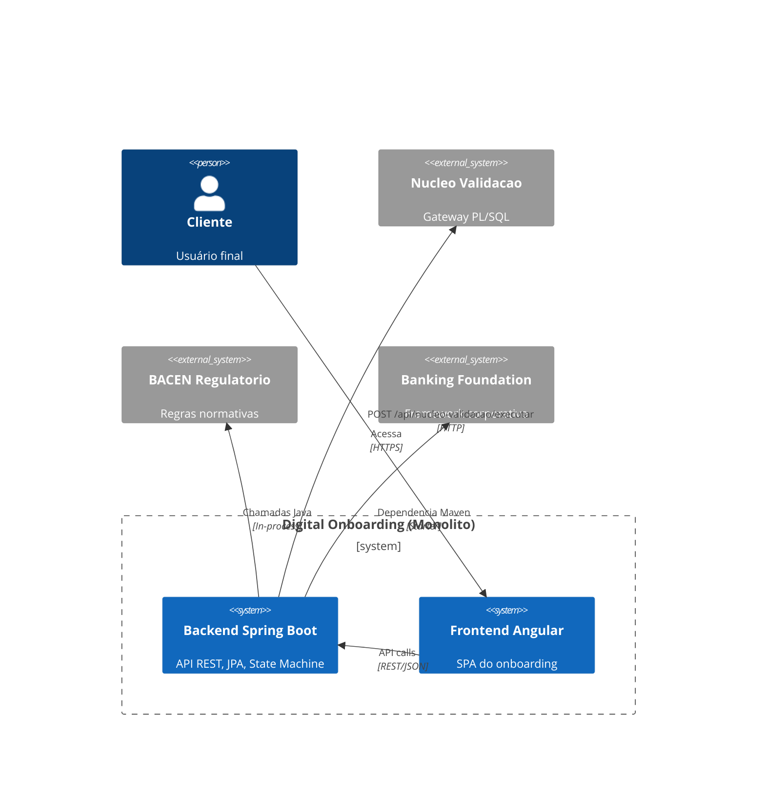
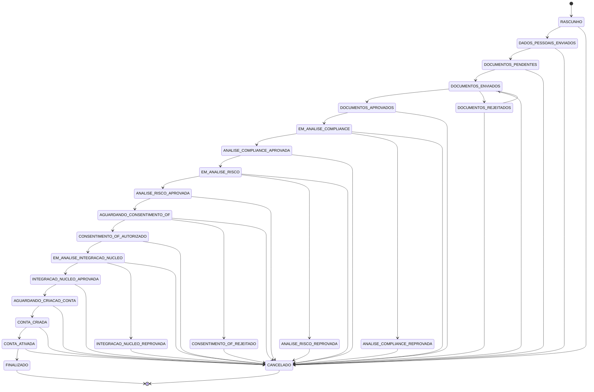

# Digital Onboarding

Monolito Spring Boot + Angular para simulação de onboarding digital de pessoas físicas e jurídicas.

## Arquitetura

O `digital-onboarding` é uma aplicação monolítica modular que consome três projetos base como dependências externas:

- **[banking-foundation](https://github.com/odevpedro/banking-foundation)** — Framework corporativo (core, web, observability, security, audit, test-support)
- **[nucleo-validacao](https://github.com/odevpedro/nucleo-validacao)** — Gateway de validações PL/SQL (Oracle)
- **[bacen-regulatorio](https://github.com/odevpedro/bacen_regulatorio)** — Biblioteca de regras regulatórias BACEN (10 módulos normativos)

### Diagrama de Contexto



### Fluxo de Onboarding



## Pré-requisitos

- Java 17+
- Node.js 18+ (para o frontend Angular)
- Docker e Docker Compose (para PostgreSQL e MinIO)
- Maven 3.9+

## Estrutura do Projeto

```
digital-onboarding/
├── pom.xml                    # Parent POM multi-módulo
├── docker-compose.yml         # Infra local (PostgreSQL + MinIO + Backend)
├── backend/
│   ├── pom.xml                # POM do módulo Spring Boot
│   ├── Dockerfile
│   └── src/main/java/com/empresa/onboarding/
│       ├── DigitalOnboardingApplication.java
│       ├── config/            # OpenAPI, CORS
│       ├── shared/            # correlation, idempotency, outbox, exception, security
│       ├── state/             # OnboardingStateMachine, StatusProposta, EtapaOnboarding
│       ├── domain/
│       │   ├── proposta/      # PropostaOnboarding, HistoricoEstado, PropostaService
│       │   ├── documentos/    # Documento, DocumentoService
│       │   ├── compliance/    # ValidacaoCompliance, ComplianceService
│       │   ├── risco/         # AnaliseRisco, RiscoService
│       │   ├── consentimento/ # ConsentimentoOpenFinance, ConsentimentoService
│       │   └── conta/         # ContaCriada, ContaService
│       ├── integration/
│       │   ├── nucleo/        # NucleoValidacaoClient (Feign), NucleoValidacaoFacade
│       │   ├── bacen/         # RegrasRegulatoriasFacade (wrapper bacen-regulatorio)
│       │   ├── simulador/     # 8 simuladores (Receita, Serpro, Biometria, etc.)
│       │   └── storage/       # MinioStorageService
│       └── controller/        # REST controllers
├── frontend/
│   ├── package.json
│   ├── angular.json
│   └── src/app/
│       ├── proposta-lista/    # Lista de propostas
│       ├── proposta-detalhe/  # Detalhes com tabs (Dados, Docs, Compliance, Risco, etc.)
│       └── proposta.service.ts
└── docs/
    └── postman/               # Coleção Postman (pendente)
```

## Endpoints da API

### Propostas
| Método | Path | Descrição |
|--------|------|-----------|
| POST | /api/propostas | Criar nova proposta |
| GET | /api/propostas | Listar todas |
| GET | /api/propostas/{id} | Buscar por ID |
| PUT | /api/propostas/{id}/dados-pessoais | Atualizar dados pessoais |
| POST | /api/propostas/{id}/cancelar | Cancelar proposta |
| GET | /api/propostas/{id}/historico | Histórico de estados |
| GET | /api/propostas/{id}/transicoes-permitidas | Transições válidas |
| POST | /api/propostas/{id}/avancar | Avançar status |

### Documentos
| Método | Path | Descrição |
|--------|------|-----------|
| GET | /api/propostas/{id}/documentos | Listar documentos |
| POST | /api/propostas/{id}/documentos | Upload de documento |
| POST | /api/propostas/{id}/documentos/{docId}/aprovar | Aprovar documento |
| POST | /api/propostas/{id}/documentos/{docId}/rejeitar | Rejeitar documento |

### Compliance
| Método | Path | Descrição |
|--------|------|-----------|
| GET | /api/propostas/{id}/compliance | Listar validações |
| POST | /api/propostas/{id}/compliance/executar | Executar validações |

### Risco
| Método | Path | Descrição |
|--------|------|-----------|
| GET | /api/propostas/{id}/risco | Buscar análise |
| POST | /api/propostas/{id}/risco/analisar | Executar análise |

### Consentimento Open Finance
| Método | Path | Descrição |
|--------|------|-----------|
| POST | /api/propostas/{id}/consentimento/solicitar | Solicitar consentimento |
| POST | /api/propostas/{id}/consentimento/{cId}/autorizar | Autorizar |
| POST | /api/propostas/{id}/consentimento/{cId}/rejeitar | Rejeitar |

### Conta
| Método | Path | Descrição |
|--------|------|-----------|
| POST | /api/propostas/{id}/conta/criar | Criar conta |
| POST | /api/propostas/{id}/conta/{cId}/ativar | Ativar conta |

## Como Executar

### 1. Infraestrutura (PostgreSQL + MinIO)

```bash
docker compose up -d postgres minio
```

### 2. Backend

```bash
cd backend
./mvnw spring-boot:run
```

Ou via Docker:

```bash
docker compose up -d backend
```

### 3. Frontend

```bash
cd frontend
npm install
npm start
```

Acessar: http://localhost:4200

## Testes

```bash
cd backend
./mvnw test
```

## Swagger UI

http://localhost:8080/swagger-ui.html

## Decisões Técnicas

- **Monólito modular**: cada domínio é um pacote separado dentro do mesmo deployable
- **State Machine explícita**: toda transição de status passa pelo `OnboardingStateMachine`
- **Idempotência**: header `Idempotency-Key` em POST/PUT/PATCH com cache de 24h
- **Outbox Pattern**: eventos de domínio persistidos em tabela e processados por scheduler
- **Correlation ID**: propagado via header `X-Correlation-Id` e MDC para logs
- **Simuladores internos**: dispensa dependências externas reais; cada simulador tem comportamento determinístico baseado no dígito verificador do documento
- **RegrasRegulatoriasFacade**: centraliza todo uso do `bacen-regulatorio`; os controllers nunca acessam diretamente

## Melhorias Futuras nas Dependências

### banking-foundation
- Implementar módulo `audit-jpa` com `@Auditable` e listener JPA
- Implementar `security` com JWT e RBAC
- Implementar `observability` com métricas e tracing distribuído
- Publicar starter no GitHub Packages

### nucleo-validacao
- Adicionar OpenAPI/Swagger
- Adicionar Feign client como artefato publicável
- Suporte a PostgreSQL como alternativa ao Oracle

### bacen-regulatorio
- Publicar artefatos no GitHub Packages
- Adicionar módulo de testes de conformidade regulatória
- Adicionar suporte a regras parametrizáveis por YAML
