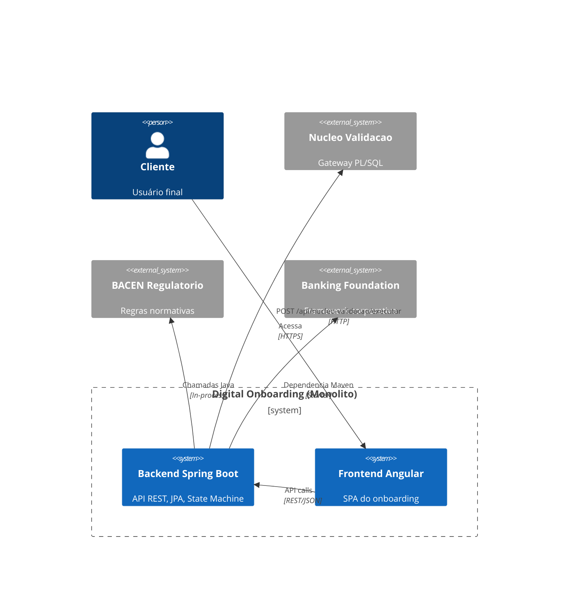
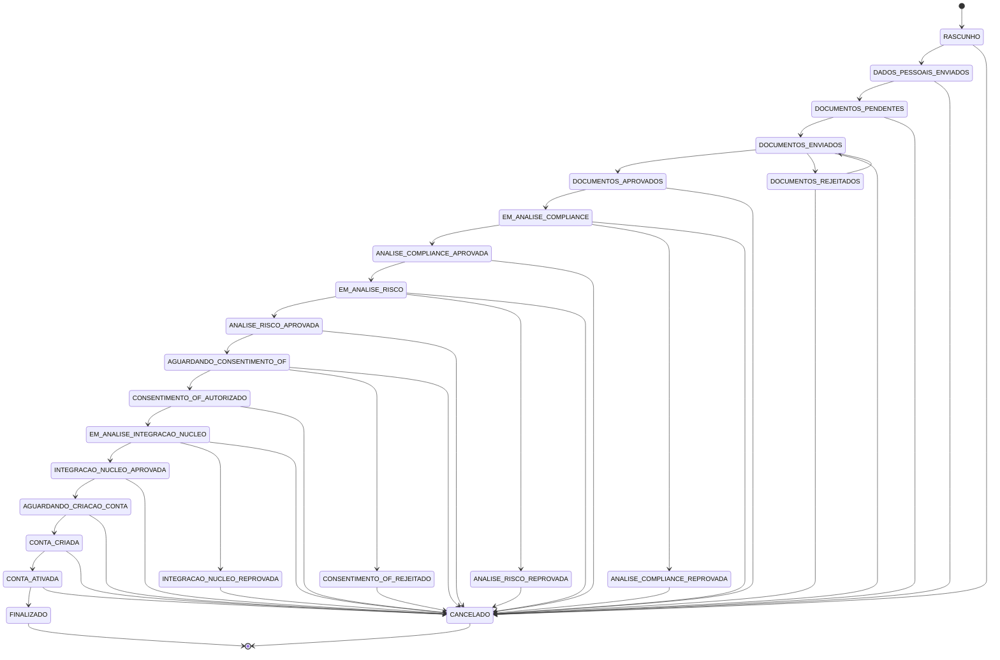

# Digital Onboarding

Monolito Spring Boot + Angular para simulação de onboarding digital de pessoas físicas e jurídicas.

## Arquitetura

O `digital-onboarding` é uma aplicação monolítica modular que consome três projetos base como dependências externas:

- **[banking-foundation](https://github.com/odevpedro/banking-foundation)** — Framework corporativo (core, web, observability, security, audit, test-support)
- **[nucleo-validacao](https://github.com/odevpedro/nucleo-validacao)** — Gateway de validações PL/SQL (Oracle)
- **[bacen-regulatorio](https://github.com/odevpedro/bacen-regulatorio)** — Biblioteca de regras regulatórias BACEN (10 módulos normativos)

### Diagrama de Contexto



### Fluxo de Onboarding



## Stack de Infraestrutura

| Componente | Tecnologia | Porta |
|------------|------------|-------|
| Banco de dados | PostgreSQL 15 | 5432 |
| Storage | MinIO | 9000 (API) / 9001 (Console) |
| Message broker | RabbitMQ 3.13 | 5672 (AMQP) / 15672 (Management) |
| Métricas | Prometheus | 9090 |
| Dashboards | Grafana 11 | 3000 (admin/admin) |
| Mock externo | Núcleo Validação (Python) | 8081 |
| Frontend | Nginx + Angular 17 | 4200 |

## Estrutura do Projeto

```
digital-onboarding/
├── pom.xml                          # Parent POM multi-modulo
├── docker-compose.yml               # Infra completa (10 servicos)
├── backend/
│   ├── pom.xml
│   ├── Dockerfile
│   └── src/main/java/com/empresa/onboarding/
│       ├── DigitalOnboardingApplication.java
│       ├── config/                   # OpenAPI, CORS
│       ├── state/                    # OnboardingStateMachine, StatusProposta
│       ├── domain/                   # proposta, documentos, compliance, risco, consentimento, conta
│       ├── integration/
│       │   ├── nucleo/               # NucleoValidacaoClient (Feign)
│       │   ├── bacen/                # RegrasRegulatoriasFacade
│       │   ├── outbox/               # RabbitMQ event handler + config
│       │   ├── simulador/            # 8 simuladores internos
│       │   └── storage/              # MinioStorageService
│       └── controller/               # 6 REST controllers com OpenAPI
├── frontend/
│   ├── Dockerfile                    # Multi-stage (node -> nginx)
│   ├── nginx.conf                    # Proxy reverso /api -> backend
│   └── src/
├── prometheus/
│   └── prometheus.yml                # Scrape config
├── grafana/
│   ├── datasources/datasource.yml    # Provisioning Prometheus
│   └── dashboards/                   # Dashboards automaticos
├── nucleo-validacao-mock/
│   ├── Dockerfile
│   └── server.py                     # Mock HTTP simples
└── minio/
    └── init.sh                        # Bucket init script
```

## Endpoints da API

### Propostas
| Método | Path | Descrição |
|--------|------|-----------|
| POST | /api/propostas | Criar nova proposta |
| GET | /api/propostas | Listar todas |
| GET | /api/propostas/{id} | Buscar por ID |
| PUT | /api/propostas/{id}/dados-pessoais | Atualizar dados pessoais |
| POST | /api/propostas/{id}/cancelar | Cancelar proposta |
| GET | /api/propostas/{id}/historico | Histórico de estados |
| GET | /api/propostas/{id}/transicoes-permitidas | Transições válidas |
| POST | /api/propostas/{id}/avancar | Avançar status |

### Documentos
| Método | Path | Descrição |
|--------|------|-----------|
| GET | /api/propostas/{id}/documentos | Listar documentos |
| POST | /api/propostas/{id}/documentos | Upload de documento |
| POST | /api/propostas/{id}/documentos/{docId}/aprovar | Aprovar documento |
| POST | /api/propostas/{id}/documentos/{docId}/rejeitar | Rejeitar documento |

### Compliance
| Método | Path | Descrição |
|--------|------|-----------|
| GET | /api/propostas/{id}/compliance | Listar validações |
| POST | /api/propostas/{id}/compliance/executar | Executar validações |

### Risco
| Método | Path | Descrição |
|--------|------|-----------|
| GET | /api/propostas/{id}/risco | Buscar análise |
| POST | /api/propostas/{id}/risco/analisar | Executar análise |

### Consentimento Open Finance
| Método | Path | Descrição |
|--------|------|-----------|
| POST | /api/propostas/{id}/consentimento/solicitar | Solicitar consentimento |
| POST | /api/propostas/{id}/consentimento/{cId}/autorizar | Autorizar |
| POST | /api/propostas/{id}/consentimento/{cId}/rejeitar | Rejeitar |

### Conta
| Método | Path | Descrição |
|--------|------|-----------|
| POST | /api/propostas/{id}/conta/criar | Criar conta |
| POST | /api/propostas/{id}/conta/{cId}/ativar | Ativar conta |

## Como Executar

### Stack completa (todos os serviços)

```bash
docker compose up -d
```

Isso sobe: PostgreSQL, MinIO, RabbitMQ, backend, frontend, Prometheus, Grafana, mock do nucleo-validacao.

Acessar:
- **Frontend:** http://localhost:4200
- **API:** http://localhost:8080
- **Swagger:** http://localhost:8080/swagger-ui.html
- **Prometheus:** http://localhost:9090
- **Grafana:** http://localhost:3000 (admin/admin)
- **RabbitMQ:** http://localhost:15672 (onboarding/onboarding)
- **MinIO Console:** http://localhost:9001 (minioadmin/minioadmin)

### Apenas dependências (dev local)

```bash
docker compose up -d postgres minio rabbitmq prometheus grafana
cd backend && ./mvnw spring-boot:run
cd frontend && npm install && npm start
```

## Testes

```bash
cd backend && ./mvnw test
# Com Testcontainers (PostgreSQL em container):
./mvnw test -Dspring.profiles.active=test
```

## Decisões Técnicas

- **Monólito modular**: cada domínio é um pacote separado dentro do mesmo deployable
- **State Machine explícita**: toda transição de status passa pelo `OnboardingStateMachine`
- **Idempotência**: header `Idempotency-Key` em POST/PUT/PATCH com cache de 24h (banking-foundation)
- **Outbox Pattern**: eventos persistidos em tabela `outbox_events` e roteados via RabbitMQ pelo `OutboxEventHandler` SPI
- **Correlation ID**: propagado via header `X-Correlation-Id` e MDC para logs (banking-foundation)
- **Métricas**: Prometheus via `micrometer-registry-prometheus` + dashboards Grafana
- **Observabilidade**: stack completa com health checks, métricas e logs estruturados
- **Simuladores internos**: dispensa dependências externas reais; cada simulador tem comportamento determinístico baseado no dígito verificador do documento
- **RegrasRegulatoriasFacade**: centraliza todo uso do `bacen-regulatorio`; os controllers nunca acessam diretamente
- **RabbitMQ**: outbox events publicados em exchange `outbox.exchange` com routing key `outbox.routing.{eventType}`
- **Containerização**: todos os serviços empacotados com Docker e orquestrados via docker-compose
